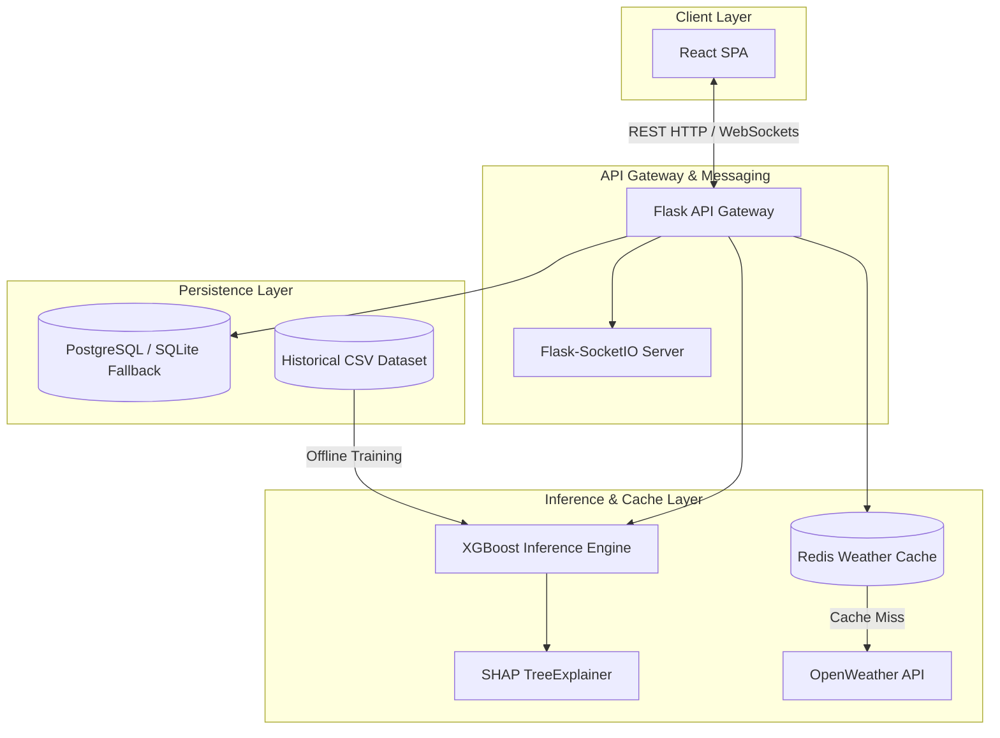

# Flight Delay AI: Real-Time Flight Delay Prediction Infrastructure

Flight Delay AI is a modular machine learning platform designed for flight delay forecasting and MLOps metrics analysis. The system is built with a decoupled services architecture, integrating a machine learning inference pipeline, distributed weather caching, real-time client updates, and statistical model drift monitoring.

---

## System Architecture

The platform uses a decoupled service-oriented architecture to separate ingestion, caching, inference, and persistence layers.



---

## Core Features

- **Modular API Gateway**: Versioned REST endpoints (API v1) with request schema validation using Pydantic v2.
- **Single Page Application (SPA)**: Built with React, Vite, and Tailwind CSS. Implements interactive Recharts analytics timelines and Framer Motion state transitions.
- **Bi-directional WebSockets**: Uses Flask-SocketIO and socket.io-client to push newly computed predictions to active clients, updating the dashboard in real-time.
- **Explainable AI (XAI)**: Calculates local feature contributions (flight duration, airport congestion, temperature, and humidity) for each prediction using SHAP TreeExplainer, presenting the positive and negative impact metrics on the frontend.
- **Distributed Caching**: Caches OpenWeather API responses in Redis for 15 minutes to reduce API latency and manage external request rate limits.
- **Embedded Analytics**: Integrated Dash dashboard querying the database on a 5-second interval to combine training data and current prediction history.
- **Session-Based Authentication**: Custom login and registration controls utilizing HTTP cookies and credential-enabled CORS.
- **Data Drift Monitoring**: An endpoint running a two-sample Kolmogorov-Smirnov test (via SciPy) comparing live prediction delays against the training dataset baseline to flag distribution shifts.
- **Dynamic Connection Fallback**: Verifies connection to the PostgreSQL instance at startup, falling back to a local SQLite database if the server is unreachable.

---

## Technology Stack

| Component | Software / Library | Purpose |
| :--- | :--- | :--- |
| **Backend Gateway** | Flask, Flask-CORS | HTTP routing, CORS controls |
| **Real-time Gateway** | Flask-SocketIO | WebSockets message broadcasting |
| **Inference Framework** | XGBoost | Supervised learning model execution |
| **Model Interpretability** | SHAP | Local feature contribution analysis |
| **Database ORM** | Flask-SQLAlchemy, PostgreSQL, SQLite | Persistence and local fallback database |
| **Cache Store** | Redis | API response caching |
| **Data Validation** | Pydantic v2 | Input schema validation |
| **Visual Analytics** | Dash, Plotly, Dash-Bootstrap | Summary charts and metrics |
| **Web SPA Core** | React, Axios | Component rendering, REST client |
| **UI Graphs** | Recharts | Frontend data visualizations |
| **Styles & Transitions** | Tailwind CSS, Framer Motion | Modern interface styles and animations |

---

## Project Directory Layout

```text
Flight-Delay-Prediction/
├── backend/
│   ├── app/
│   │   ├── core/           # App settings and environment validation
│   │   ├── models/         # Database models (User, Prediction)
│   │   ├── services/       # XGBoost inference and Redis weather services
│   │   └── api/            # API blueprints (Auth, Predict, Stats, Drift)
│   ├── Dockerfile          # Backend container builder
│   ├── requirements.txt    # Python dependencies
│   ├── run.py              # Backend HTTP server (Port 5000)
│   ├── seed.py             # Database seed script
│   └── analytics.py        # Dash analytics dashboard (Port 8050)
├── frontend/
│   ├── src/
│   │   ├── components/     # React components (Navbar, Form, Autocomplete)
│   │   ├── App.jsx         # App container (WebSockets, Auth, Recharts)
│   │   └── index.css       # Tailwind CSS imports & global styles
│   ├── index.html          # HTML Entrypoint
│   └── Dockerfile          # Nginx production frontend server
├── ml/
│   ├── models/             # Saved models and preprocessing pipeline medians
│   └── pipeline/           # Data cleaning and model training scripts
├── data/
│   └── flight_data.csv     # Training dataset
├── scripts/
│   └── generate_data.py    # Training data generator script
└── docker-compose.yml      # Multi-container local execution setup
```

---

## Installation and Setup

### Prerequisites
- Python 3.11+
- Node.js 20+
- (Optional) Docker and Docker Compose

### 1. Local Environment Execution

#### A. Set up Python Virtual Environment
```bash
python -m venv venv
# On Windows
.\venv\Scripts\activate
# On macOS/Linux
source venv/bin/activate

pip install -r requirements.txt
```

#### B. Install Node Dependencies
```bash
cd frontend
npm install
cd ..
```

#### C. Seed Database and Start Services
Seed the fallback SQLite database:
```bash
python backend/seed.py
```
Start the application services in separate terminals:
```bash
# 1. API Server (Port 5000)
python backend/run.py

# 2. Analytics Dashboard (Port 8050)
python backend/analytics.py

# 3. Web Client (Port 5173)
cd frontend
npm run dev
```

---

### 2. Containerized Deployment (Docker Compose)

To build and run all services (API, React Client, Dash Analytics, PostgreSQL, and Redis) concurrently:
```bash
docker-compose up --build
```
The mapped endpoints are:
- **React Client**: `http://localhost:3000`
- **Backend API**: `http://localhost:5000`
- **Dash Analytics**: `http://localhost:8050`
- **Redis Cache**: `localhost:6379`
- **PostgreSQL Database**: `localhost:5432`

---

## Configuration Variables (`.env`)

Configure the environment settings by creating a `.env` file in the root directory:
```ini
# OpenWeather API Credentials
WEATHER_API_KEY=your_openweathermap_api_key

# Database Connectivity (db is default for Docker; falls back to SQLite locally)
POSTGRES_SERVER=db
POSTGRES_USER=postgres
POSTGRES_PASSWORD=Ganesh@123
POSTGRES_DB=flight_delay_db

# Application Encryption Key
SECRET_KEY=SUPER-SECRET-KEY-REPLACE-IN-PRODUCTION

# Cache Configuration
REDIS_HOST=redis
REDIS_PORT=6379
```

---

## Statistical Analysis and Explainability

### 1. Two-Sample Kolmogorov-Smirnov Test (Drift Monitoring)
Data drift verification is exposed through the endpoint:
```http
GET http://localhost:5000/api/v1/predict/drift
```
It computes the two-sample KS test statistic and p-value comparing the distribution of the last 100 predictions against the training set labels. A p-value less than 0.05 indicates statistical shift (drift), indicating the model should be retrained.

### 2. SHAP (Shapley Additive exPlanations)
To provide interpretability for the model predictions, the local attribution is computed:
$$f(x) = g(z') = \phi_0 + \sum_{i=1}^{M} \phi_i z_i'$$
Where $\phi_0$ is the model's base value and $\phi_i$ is the delay contribution (in minutes) of each input feature. The backend returns these values in the prediction payload to explain predictions inside the client interface.

---

## Project Roadmap & Future Implementations

- [x] **Real-time WebSockets**: Client synchronization via Socket.io events.
- [x] **Stateful Preprocessing**: Fixed inference imputation using saved training medians.
- [x] **Inference Caching**: Weather cache layers in Redis.
- [ ] **Multi-Service Cloud Deployment**:
  - Deploy static React frontend client to **Vercel** or **Netlify**.
  - Host the containerized Python/Flask API gateway to **Render** / **Koyeb** running with Gevent WSGI workers.
  - Migrate database storage to serverless **Neon PostgreSQL** (removing SQLite dependency).
  - Connect weather API query cache layers to serverless **Upstash Redis**.
- [ ] **Kubernetes Manifests**: Helm charts for deployment orchestration in production clusters.
- [ ] **Automated CI/CD**: GitHub Actions workflows for continuous integration tests and auto-deployment on git push.
- [ ] **Telematic Alerting**: Automated alerts via Prometheus/Grafana triggered by statistical model drift indicators.
# FlightDelay

# FlightDelay

